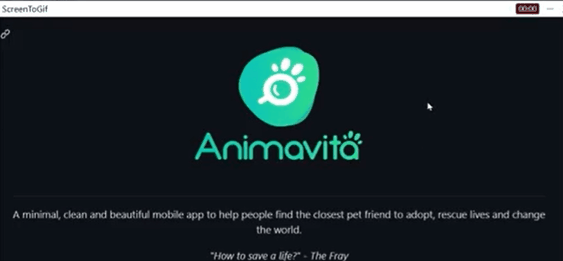

# Projeto com README
Um projeto de teste com um arquivo README 🧙‍♂️💕

[]

## Tecnologias utilizadas
- HTML
- CSS
- JS

## Como utilizar

1 - Clone pro o projeto
```

Git Clone <url>
```
2 - Acesse a pasta do projeto
cd repositorio-com-readme
```

cd repositorio-com-readme
```
 

